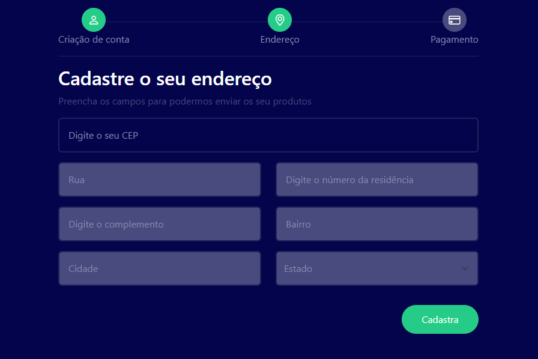
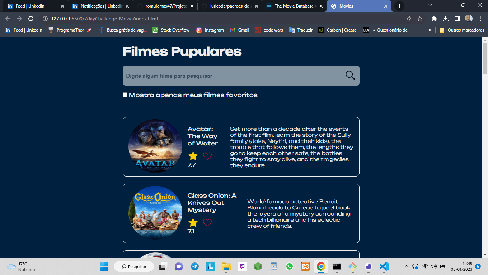

### Projetos em Js

## Objetivo 

Praticar

<table border = "1">
<tr>
<td> 
<h2>Média</h2>

</td>

<td> 
<h2>Preenchimento de endereço</h2>

</td>

<td> 
<h2>#7dayChallengeMovie</h2>

</td>

</tr>
</table>

Adicionar projeto m